# WPF driver-client — Navigation Map

Source-derived map of every `page.Navigate(...)` call in the WPF client. Arrows are labeled with the button / handler that triggers the navigation.

## Color Legend
- 🟦 **Auth** (entry, role pick, login, sign-up)
- 🟩 **Student**
- 🟧 **Teacher**
- 🟥 **Admin**
- ⬜ **Shared** (Chat, Tickets)

## Master Flow

```mermaid
flowchart TD
    %% ===== Entry / Auth =====
    MainWindow["🟦 MainWindow<br/>(app entry)"]
    RoleSelection["🟦 RoleSelection<br/>Student / Teacher / Login"]
    LogIn["🟦 LogIn"]
    SignUp["🟦 SignUp"]
    ChooseTeacher["🟦 ChooseTeacher<br/>(pick or browse reviews)"]
    Rewiews["🟦 Rewiews<br/>(read-only reviews)"]

    MainWindow -->|on load| RoleSelection
    RoleSelection -->|Student card| ChooseTeacher
    RoleSelection -->|Teacher card| SignUp
    RoleSelection -->|Login link| LogIn
    LogIn -->|Sign Up btn| RoleSelection
    LogIn -->|Login OK / IsTeacher| TeacherUI
    LogIn -->|Login OK / Student| StudentUI

    SignUp -->|Back| RoleSelection
    SignUp -->|Choose Teacher btn| ChooseTeacher
    SignUp -->|Register OK -> Choose Teacher| ChooseTeacher

    ChooseTeacher -->|Choose btn| SignUp
    ChooseTeacher -->|See Reviews btn| Rewiews
    ChooseTeacher -->|Back / chooseMode=true| RoleSelection
    ChooseTeacher -->|Back / chooseMode=false| StudentUI

    Rewiews -->|Back| ChooseTeacher

    %% ===== Student =====
    StudentUI["🟩 StudentUI<br/>(student dashboard)"]
    ScheduleLesson["🟩 ScheduleLesson"]
    WriteRewiew["🟩 WriteRewiew"]
    ViewLessons["🟩 ViewLessons<br/>(My Lessons)"]
    StudentPayment["🟩 StudentPayment"]
    StudentNotifications["🟩 StudentNotifications"]

    StudentUI -->|Schedule Lesson| ScheduleLesson
    StudentUI -->|Write Review| WriteRewiew
    StudentUI -->|My Lessons| ViewLessons
    StudentUI -->|Payments| StudentPayment
    StudentUI -->|Notifications| StudentNotifications
    StudentUI -->|See Reviews| ChooseTeacher
    StudentUI -->|Chat| Chat
    StudentUI -->|Support Tickets| MyTickets
    StudentUI -->|Logout| LogIn

    ScheduleLesson -->|Back / Confirm| StudentUI
    WriteRewiew -->|Back / Submit| StudentUI
    ViewLessons -->|Back| StudentUI
    StudentPayment -->|Back| StudentUI
    StudentNotifications -->|Back| StudentUI

    %% ===== Teacher =====
    TeacherUI["🟧 TeacherUI<br/>(teacher dashboard)"]
    AllStudents["🟧 AllStudents"]
    Teacher_Schedule["🟧 Teacher_Schedule"]
    TeacherPaymentReports["🟧 TeacherPaymentReports"]
    TeacherConfirmPayments["🟧 TeacherConfirmPayments"]
    TeacherNotifications["🟧 TeacherNotifications"]
    TeacherSettings["🟧 TeacherSettings"]
    StudentPricingManagement["🟧 StudentPricingManagement"]
    CalendarTeacher["🟧 CalendarTeacher"]

    TeacherUI -->|Admin Dashboard btn / IsAdmin| AdminDashboard
    TeacherUI -->|My Students| AllStudents
    TeacherUI -->|Calendar| CalendarTeacher
    TeacherUI -->|Schedule| Teacher_Schedule
    TeacherUI -->|Payment Reports| TeacherPaymentReports
    TeacherUI -->|Confirm Payments| TeacherConfirmPayments
    TeacherUI -->|Notifications| TeacherNotifications
    TeacherUI -->|Chat| Chat
    TeacherUI -->|Support Tickets| MyTickets
    TeacherUI -->|Settings| TeacherSettings
    TeacherUI -->|Logout| LogIn

    AllStudents -->|Back| TeacherUI
    Teacher_Schedule -->|Back| TeacherUI
    TeacherPaymentReports -->|Back| TeacherUI
    TeacherConfirmPayments -->|Back| TeacherUI
    TeacherNotifications -->|Back| TeacherUI
    CalendarTeacher -->|Back| TeacherUI
    TeacherSettings -->|Back| TeacherUI
    TeacherSettings -->|Manage Student Prices| StudentPricingManagement
    StudentPricingManagement -->|Back| TeacherSettings

    %% ===== Admin =====
    AdminDashboard["🟥 AdminDashboard"]
    AdminTicketManagement["🟥 AdminTicketManagement"]
    AdminUserManagement["🟥 AdminUserManagement"]
    AdminTicketDetails["🟥 AdminTicketDetails"]

    AdminDashboard -->|Ticket Management| AdminTicketManagement
    AdminDashboard -->|User Management| AdminUserManagement
    AdminDashboard -->|Back| TeacherUI

    AdminTicketManagement -->|View / Take / Resolve| AdminTicketDetails
    AdminTicketManagement -->|Back| AdminDashboard
    AdminUserManagement -->|Back| AdminDashboard
    AdminTicketDetails -->|Back / Resolve & Close| AdminTicketManagement

    %% ===== Shared (Chat / Tickets) =====
    Chat["⬜ Chat"]
    MyTickets["⬜ MyTickets"]
    CreateTicket["⬜ CreateTicket"]
    TicketDetails["⬜ TicketDetails"]

    Chat -->|Back / Teacher| TeacherUI
    Chat -->|Back / Student| StudentUI

    MyTickets -->|New Ticket| CreateTicket
    MyTickets -->|Open Ticket row| TicketDetails
    MyTickets -->|Back / Teacher| TeacherUI
    MyTickets -->|Back / Student| StudentUI

    CreateTicket -->|After create| MyTickets
    CreateTicket -->|Cancel / Teacher| TeacherUI
    CreateTicket -->|Cancel / Student| StudentUI

    TicketDetails -->|Back| MyTickets

    %% ===== Styling =====
    classDef auth fill:#1a2e50,stroke:#00E0FF,color:#fff
    classDef student fill:#1B2D47,stroke:#27AE60,color:#fff
    classDef teacher fill:#3d2a14,stroke:#F39C12,color:#fff
    classDef admin fill:#3d1414,stroke:#E74C3C,color:#fff
    classDef shared fill:#1f1f2e,stroke:#bdbdbd,color:#fff

    class MainWindow,RoleSelection,LogIn,SignUp,ChooseTeacher,Rewiews auth
    class StudentUI,ScheduleLesson,WriteRewiew,ViewLessons,StudentPayment,StudentNotifications student
    class TeacherUI,AllStudents,Teacher_Schedule,TeacherPaymentReports,TeacherConfirmPayments,TeacherNotifications,TeacherSettings,StudentPricingManagement,CalendarTeacher teacher
    class AdminDashboard,AdminTicketManagement,AdminUserManagement,AdminTicketDetails admin
    class Chat,MyTickets,CreateTicket,TicketDetails shared
```

## Per-page button → destination table

### Auth
| Page | Button | Goes to |
|------|--------|---------|
| MainWindow | (auto on load) | RoleSelection |
| RoleSelection | Student card | ChooseTeacher (chooseMode=true) |
| RoleSelection | Teacher card | SignUp (isTeacher=true) |
| RoleSelection | Login link | LogIn |
| LogIn | Sign In (Student) | StudentUI |
| LogIn | Sign In (Teacher) | TeacherUI |
| LogIn | Sign Up | RoleSelection |
| SignUp | Back | RoleSelection |
| SignUp | Choose Teacher | ChooseTeacher |
| SignUp | Register OK | ChooseTeacher |
| ChooseTeacher | Choose | SignUp(isTeacher=false) |
| ChooseTeacher | See Reviews | Rewiews |
| ChooseTeacher | Back / chooseMode=true | RoleSelection |
| ChooseTeacher | Back / chooseMode=false | StudentUI |
| Rewiews | Back | ChooseTeacher |

### Student
| Page | Button | Goes to |
|------|--------|---------|
| StudentUI | Schedule Lesson | ScheduleLesson |
| StudentUI | Write Review | WriteRewiew |
| StudentUI | My Lessons | ViewLessons |
| StudentUI | Payments | StudentPayment |
| StudentUI | Notifications | StudentNotifications |
| StudentUI | See Reviews | ChooseTeacher(false) |
| StudentUI | Chat | Chat |
| StudentUI | Support Tickets | MyTickets |
| StudentUI | Logout | LogIn |
| ScheduleLesson | Confirm / Back | StudentUI |
| WriteRewiew | Submit / Back | StudentUI |
| ViewLessons | Back | StudentUI |
| StudentPayment | Back / Pay OK | StudentUI |
| StudentNotifications | Back | StudentUI |

### Teacher
| Page | Button | Goes to |
|------|--------|---------|
| TeacherUI | Admin Dashboard | AdminDashboard |
| TeacherUI | My Students | AllStudents |
| TeacherUI | Calendar | CalendarTeacher |
| TeacherUI | Schedule | Teacher_Schedule |
| TeacherUI | Payment Reports | TeacherPaymentReports |
| TeacherUI | Confirm Payments | TeacherConfirmPayments |
| TeacherUI | Notifications | TeacherNotifications |
| TeacherUI | Chat | Chat |
| TeacherUI | Support Tickets | MyTickets |
| TeacherUI | Settings | TeacherSettings |
| TeacherUI | Logout | LogIn |
| AllStudents | Back | TeacherUI |
| Teacher_Schedule | Back | TeacherUI |
| TeacherPaymentReports | Back | TeacherUI |
| TeacherConfirmPayments | Back | TeacherUI |
| TeacherNotifications | Back | TeacherUI |
| CalendarTeacher | Back | TeacherUI |
| TeacherSettings | Manage Student Prices | StudentPricingManagement |
| TeacherSettings | Back | TeacherUI |
| StudentPricingManagement | Back | TeacherSettings |

### Admin (visible only when teacher.IsAdmin = true)
| Page | Button | Goes to |
|------|--------|---------|
| AdminDashboard | Ticket Management | AdminTicketManagement |
| AdminDashboard | User Management | AdminUserManagement |
| AdminDashboard | Back | TeacherUI |
| AdminTicketManagement | View / Take / Resolve | AdminTicketDetails |
| AdminTicketManagement | Back | AdminDashboard |
| AdminUserManagement | Back | AdminDashboard |
| AdminTicketDetails | Resolve & Close / Back | AdminTicketManagement |

### Shared
| Page | Button | Goes to |
|------|--------|---------|
| Chat | Back (Teacher) | TeacherUI |
| Chat | Back (Student) | StudentUI |
| MyTickets | New Ticket | CreateTicket |
| MyTickets | Open Ticket | TicketDetails |
| MyTickets | Back (Teacher) | TeacherUI |
| MyTickets | Back (Student) | StudentUI |
| CreateTicket | After create | MyTickets |
| CreateTicket | Cancel (Teacher) | TeacherUI |
| CreateTicket | Cancel (Student) | StudentUI |
| TicketDetails | Back | MyTickets |

## Orphans (unreferenced from any nav handler)
- `StudentCourses` and `CourseDetails` — no incoming nav (StudentUI's "Courses" button shows a "Coming Soon" MessageBox).
- `TeacherCourseManagement` — no incoming nav.

## Photos
This map is text/diagram only. To add real screenshots:
1. Run the app and capture each page (Win+Shift+S).
2. Save as `nav-map/screenshots/<PageName>.png` (e.g. `LogIn.png`, `StudentUI.png`).
3. Open `WPF_NavMap.html` — the page cards will render screenshots automatically when files exist.
